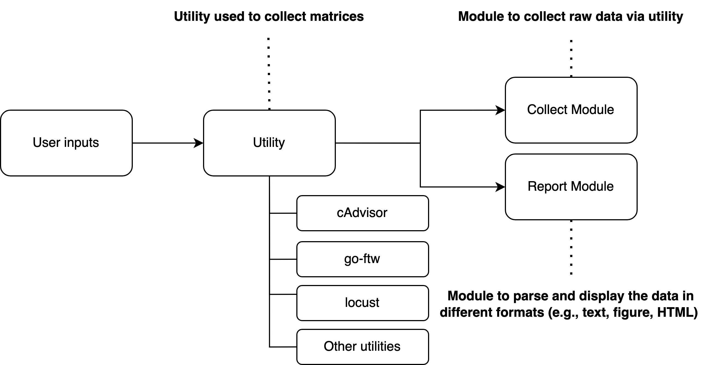

<h1><p style="text-align: center;">
GSoC 2023 - CRS: WAF Performance Testing Framework
</p></h1>

> Contributor: [Dexter Chang](https://github.com/dextermallo)
>
> Organisation: OWASP Foundation
>
> Mentor: [Felipe Zipitría / fzipi](https://github.com/fzipi), [Christian Folini / dune73](https://github.com/dune73)
>
> Link to GSOC 2023 Project List: https://summerofcode.withgoogle.com/programs/2023/projects/jdv2MaJR

---

### Table of Contents

- [Introduction](#introduction)
- [Use case](#use-case)
    - [Interactive Mode](#interactive-mode)
    - [Pipeline Mode](#pipeline-mode)
- [Utils and Metrics](#utils-and-metrics)
- [Get Started](#get-started)
    - [Prerequisite](#prerequisite)
    - [Quick Start](#quick-start)
    - [1. Start a Test](#1-start-a-test)
    - [2. Get a Report](#2-get-reports)
    - [3. Thresholds](#3-thresholds)
    - [4. Other Commands](#4-other-commands)
    - [5. Integrate with New Utils](#5-integrate-with-new-utils)
    - [6. Unit Tests](#6-unit-tests)
---

# Introduction

Performance evaluation is one of the concerns when using [OWASP Core Rule Sets](https://coreruleset.org/docs/). More specifically, people take different approaches to examine the performance, such as stability tests (e.g., the peak of I/O, speed of re-connection, RTT) and capacity tests (e.g., use of disks). However, individuals often lack comprehensive tools for measuring the performance characteristics of WAF configurations.

While performance evaluation is a challenge for the users, it is an obstacle for the community as well. Although there are automated tests in Core Rule Set when releasing the project (using [go-ftw](https://github.com/coreruleset/go-ftw)), comprehensive performance testing and metrics collection are not fully integrated into the pipeline. This framework builds upon go-ftw and other tools to provide a unified performance testing solution.

A list of deliverables in this GSoC project includes:
1. Define a framework for testing performance for a generic WAF using Core Rule Set (e.g., ModSecurity 2.9, 3.0+, and Coraza).
2. Research existing utilities for performance testing on WAF.
3. Implement different types of performance testing.
4. Integrate the CLI tool with pipelines (e.g., GitHub pipeline).
5. Based on the existing Docker images, perform different evaluations with different configurations/versions.
6. Documentation.

# Workflow and Process

The following diagram depicts the workflow and process of the framework:



Specifically, there are two terms to be considered when using the framework:

1. **Utility**: A utility means a tool that is used to collect metrics in the framework. For instance, people may be interested in measuring CPU and memory usage. Therefore, cAdvisor can be used to collect these metrics.
2. **Metrics**: Metrics are the values that you are measuring. For example, CPU and memory usage are the metrics that you collect in the previous example.

You must choose the appropriate utility to collect the metrics you are looking for. Details of the supported utilities and metrics can be found in Section [Utils and Metrics](#utils-and-metrics).

Meanwhile, each utility must implement two modules:
1. **Collect Module**: Collect module is called when the command `poetry run collect` is executed. The collect module is responsible for collecting the metrics from the utility. For example, the `ftw` utility invokes the go-ftw command-line tool to run tests and collect runtime metrics. These data are classified as raw data.
2. **Report Module**: Report module is called when the command `poetry run report` is executed. The report module is responsible for parsing and visualizing the data in different formats (e.g., text, image, HTML).

# Use cases

The framework supports two use cases:

## Interactive Mode

As a contributor, you may want to test the performance characteristics of your WAF configuration. For example, you might want to understand:

- CPU: what is the CPU usage under the current configuration?
- Memory: how much memory does the WAF consume?
- Network I/O: what is the network I/O performance?
- Load testing: how does the WAF perform under heavy load?
- Runtime: what is the response time for different test cases?

The framework allows you to collect performance metrics for your current WAF configuration and validate them against defined thresholds. To use the framework, run the following commands:

```sh
# Collect performance data from different utilities
poetry run collect --test-name my-performance-test --utils ftw,locust

# Generate the report for ftw
poetry run report --test-name my-performance-test --utils ftw

# Generate the report for locust (different utils may have different output formats)
poetry run report --test-name my-performance-test --utils locust
```

Example workflow for testing rule 920170:

```sh
# Run performance tests on your current WAF configuration
poetry run collect --test-name rule-920170-test --utils ftw,cAdvisor

# Generate reports to analyze the performance metrics
poetry run report --test-name rule-920170-test --utils ftw
poetry run report --test-name rule-920170-test --utils cAdvisor

# Use thresholds to validate performance meets requirements
poetry run report --test-name rule-920170-test --utils ftw --threshold "./config"
```

The reports will show:
- **cAdvisor**: CPU and memory usage metrics, with threshold validation if configured
- **locust**: Response time percentiles (p50, p66, p75, etc.), requests per second, and content size
- **ftw**: Runtime metrics, success/failed rates for test cases

## Pipeline Mode

As a maintainer, you may want to ensure that the WAF performance meets specific requirements before releasing a new version. The framework allows you to set up performance thresholds that must be met for the pipeline to pass. For example, you might want to ensure: **If rule "920170" runtime exceeds a certain threshold, the pipeline should fail.**

You can use the framework to test the WAF performance and validate it against defined thresholds. To use thresholds, create a configuration file. For example:

```json
{
    "util_name": "ftw",
    "threshold_version": "0.0.1",
    "thresholds": [
        {
            "id": 1,
            "threshold_name": "avg_920170_test_cases_runtime_limit",
            "threshold_desc": "rule 920170 runtime must not exceed threshold",
            "metric_name": "runtime",
            "comparison_unit": "seconds",
            "comparison_method": "lessThan",
            "threshold": 5.0,
            "include_labels": ["920170"],
            "exclude_labels": null
        }
    ]
}
```

Run the following commands in your CI/CD pipeline:
```sh
# Collect performance metrics
poetry run collect --test-name pipeline-test --utils ftw

# Generate report and validate against thresholds
# The --threshold-conf argument defines the path to the threshold configuration file
poetry run report --test-name pipeline-test --utils ftw --threshold-conf "./config"

# If thresholds are not met, the report command will indicate failures
# and your pipeline can be configured to fail based on the exit code
```

# Utils and Metrics

The framework currently supports three utilities for performance testing. Each utility collects different performance metrics:

**Note:** The `ftw` utility in this framework uses [go-ftw](https://github.com/coreruleset/go-ftw), which must be installed separately (see Prerequisites). The Python framework acts as a wrapper to orchestrate go-ftw and other testing tools.

| Utils | [locust](https://locust.io/) | [cAdvisor](https://github.com/google/cadvisor) | go-ftw |
|---|---|---|---|
| Description | Load testing tool | Container resource monitoring | Functional testing with go-ftw |
| Metrics | p50, p66, p75, ..., p99.99, p100; request per sec; average content size; min/max/avg/median response time | CPU (user, system, total); Memory (usage, cache); etc. | Runtime; Success/Failed/Skipped count |
| Test cases | based on go-ftw yaml | N/A (monitors containers) | based on go-ftw yaml format |
| Usage in CLI | `--utils locust` | `--utils cAdvisor` | `--utils ftw` |

# Get Started

The following sections will guide you to get started with the framework.

## Prerequisite

To run the framework, you need to install the following tools:
- [Poetry](https://python-poetry.org/docs/#installation)
- [Python ≥ 3.11.0](https://www.python.org/downloads/)
- [Docker](https://docs.docker.com/get-docker/)
- [go-ftw](https://github.com/coreruleset/go-ftw) - For running functional tests (install via `go install github.com/coreruleset/go-ftw@latest` or download from releases)

## Quick Start

```sh
git clone git@github.com:coreruleset/rules-performance-tests.git
cd rules-performance-tests

# the framework relies on coreruleset, in which init.sh installs the necessary files
# you may need to check if coreruleset/go-ftw is runnable if you are not running this script
source init.sh

poetry install

# Make sure go-ftw is installed and available in your PATH
# Install via: go install github.com/coreruleset/go-ftw@latest
# Or download from: https://github.com/coreruleset/go-ftw/releases

# Start collecting performance metrics using go-ftw:
poetry run collect --test-name test --utils ftw

# Generate a report from the collected data
poetry run report --test-name test --utils ftw

# Use thresholds to validate performance
poetry run report --test-name test --utils ftw --threshold "./config"
```

## 1. Start a Test

```sh
# Start a performance test, where --test-name represents the name of the test,
# and --utils represents the utility/utilities for testing.
poetry run collect --test-name test --utils ftw

# Run multiple utils at a time
poetry run collect --test-name test --utils ftw,locust,cAdvisor

# Specify custom rules and test cases directories
poetry run collect --test-name test --utils ftw --rules-dir ./rules --test-cases-dir ./tests/regression/tests

# The test will generate these files and directories automatically:
# -- Project directory
#     |-- report (report data created by command `poetry run report`)
#          |-- $TEST_NAME
#               |-- <util>_report
#     |-- data (raw data collected from the util)
#          |-- $TEST_NAME
#               |-- <util>.json (e.g., ftw.json, locust_stats.csv)
#     |-- tmp (stores the temporary files during the test)
#          |-- $TEST_NAME
#               |-- exec.py (the script created by locust to run the test)

# Available command options:
# --test-name         (required): the name of the test
# --utils             (required): utility for testing, use comma to separate multiple utils
# --raw-output        (optional): raw data output directory, default is ./data
# --output            (optional): report output directory, default is ./report
# --waf-endpoint      (optional): WAF endpoint URL, default is http://localhost:80
# --rules-dir         (optional): directory containing WAF rules, default is ./rules
# --test-cases-dir    (optional): directory containing test cases, default is ./tests/regression/tests
# --mode              (optional): mode for running the command, default is cli
```

## 2. Get a Report

```sh
# --test-name       (required)
# --threshold-conf  (optional): default is none
# --raw-output      (optional): default is ./data
# --output          (optional): default is ./report
# --format          (optional): default is text
# --utils           (optional): default is all

# without threshold
poetry run report --test-name test

# using threshold
poetry run report --test-name test --utils ftw --threshold "./config" -format text
```

## 3. Thresholds (WIP)

## 4. Other Commands (WIP)

## 5. Integrate with New Utils (WIP)

## 6. Unit Tests (WIP)

To run the unit tests and yield a test coverage report of the framework, you can follow the commands below:

```sh
#run unit tests
poetry run coverage run -m pytest

# create a coverage report
poetry run coverage report -m
```
