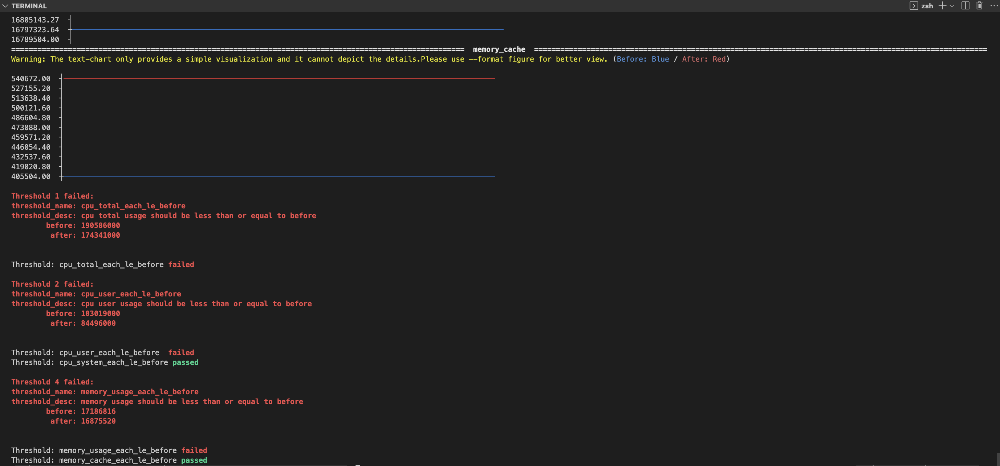
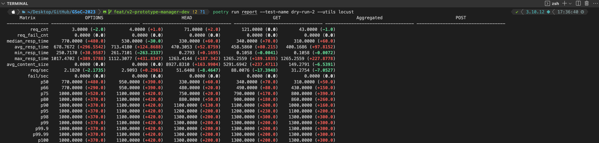
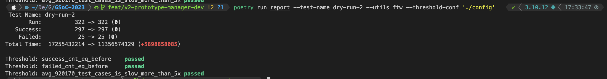

<h1><p style="text-align: center;">
GSoC 2023 - CRS: WAF Performance Testing Framework
</p></h1>

> Contributor: [Dexter Chang](https://github.com/dextermallo)
>
> Organisation: OWASP Foundation
>
> Mentor: fzipitria, Christian Folini
>
> Link to GSOC 2023 Project List: https://summerofcode.withgoogle.com/programs/2023/projects/jdv2MaJR

---

### Table of Contents

- [Introduction](#introduction)
- [Use case](#use-case)
    - [Interactive Mode](#interactive-mode)
    - [Pipeline Mode](#pipeline-mode)
- [Utils and Matrices](#utils-and-matrices)
- [Get Started](#get-started)
    - [Prerequisite](#prerequisite)
    - [Quick Start](#quick-start)
    - [1. Start a Test](#1-start-a-test)
    - [2. Get a Report](#2-get-reports)
    - [3. Thresholds](#3-thresholds)
    - [4. Other Commands](#4-other-commands)
    - [5. Integrate with New Utils](#5-integrate-with-new-utils)
    - [6. Unit Tests](#6-unit-tests)
---

# Introduction

Performance evaluation is one of the concerns when using [OWASP Core Rule Sets](https://coreruleset.org/docs/). More specifically, people take different approaches to examine the performance, such as stability tests (e.g., the peak of I/O, speed of re-connection, RTT) and capacity tests (e.g., use of disks). However, individuals often miss measuring the performance when using 3rd-party library, namely before/after using the WAFs.

While performance evaluation is a challenge for the users, it is an obstacle for the community as well. Although there are automated tests in Core Rule Set when releasing the project (using another library called [go-ftw](https://github.com/coreruleset/go-ftw)), performance tests are yet to be integrated into the pipeline.

A list of deliverables in this GSoC project includes:
1. Define a framework for testing performance for a generic WAF using Core Rule Set (e.g., ModSecurity 2.9, 3.0+, and Coraza).
2. Research existing utilities for performance testing on WAF.
3. Implement different types of performance testing.
4. Integrate the CLI tool with pipelines (e.g., GitHub pipeline).
5. Based on the existing Docker images, perform different evaluations with different configurations/versions.
6. Documentation.

# Workflow and Process

The following diagram depicts the workflow and process of the framework:


Specifically, there are two terms to be considered when using the framework:

1. **Utility**: A utility means a tool that is used to collect matrices in the framework. For instance, people may be interested in how a change will impact CPU and memory usage. Therefore, cAdvisor can be used to collect these matrices.
2. **Matrices**: Matrices are the value that you are looking for. For example, CPU and memory usage are the matrices that you are looking for in the previous example.

You must choose the appropriate utility to collect the matrices you are looking for. Details of the supported utilities and matrices can be found in Section [Utils and Matrices](#utils-and-matrices).

Meanwhile, Each utility must implement two modules:
1. **Collect Module**: Collect module is called when the command `poetry run collect` is executed. The collect module is responsible for collecting the matrices from the utility. These data are classified as raw data.
2. **Report Module**: Report module is called when the command `poetry run report` is executed. The report module is responsible for parsing and visualizing the data in different formats (e.g., text, image, HTML).

# Use cases

The framework supports two use cases:

## Interactive Mode

As a contributor, they may want to test code changes for a regex in the WAF. For example:

```sh
# original
SecRule REQUEST_METHOD "@rx ^(?:GET|HEAD)$" \

# after a code change
SecRule REQUEST_METHOD "@rx ^(?:GET|POST|HEAD)$" \
```

However, they do not know whether the code change will affect the performance of the WAF.
Specifically, they may be interested in whether the changes will affect the following matrices:
- CPU: does the code change increase CPU usage?
- Memory: does the code change increase memory usage?
- Network I/O: does the code change increase network I/O?
- Load testing: does the code change impact when the WAF is under heavy load?
- etc.

Therefore, they can use the framework to test the performance before/after the code change. To use the framework, they can run the following command:

```sh
# collect the data from different utils
poetry run collect --test-name test --utils ftw,locust

# generate the report
poetry run report --test-name test --utils ftw

# different utils may have different output format for reports
poetry run report --test-name test --utils locust
```

To demonstrate how the framework can help to dive into the performance bottleneck, we use the following example to show how the framework can help to find the bottleneck. Here are the changes in the test:

```md
# Test case: rule 920170.
# The changes are made in the regex to test whether
# the performance will be affected.
# Specifically, it is obvious that the regex is expanded, and 
# the performance, like runtime, should be longer than before.

# before
SecRule REQUEST_METHOD "@rx ^(?:GET|HEAD)$" \

# after ( 200 random words which have 3 - 5 digits are added)
SecRule REQUEST_METHOD "@rx ^(?:cat|car|road|...( 200 random words which have 3 - 5 digits)|dark|bright|GET|HEAD)$" \
```

Here are the results of running the command `poetry run report`.

- cAdvisor (three thresholds are failed): While cAdvisor is used to collect the CPU and memory usage, the following figure shows that Thresholds 1, 2 and 4 failed because the matrices (CPU total/user, memory) are higher than before.
    
- locust (without threshold): In the figure, you can see most of the matrices are marked in red, which represents the increase of the matrices. Specifically, matrices of p50, p66, and so on are increased.
    
- ftw (all thresholds are passed): In the figure, the total runtime is increased, which is expected.
    

## Pipeline Mode

As a maintainer, they may want to test the performance of the WAF when releasing a new version. For example, they may want to know whether the new version of the WAF will affect the performance of the WAF. Meanwhile, they may want to set up thresholds for the performance. For example, they may want to set the following thresholds: **If a rule change on rule "920170" affects the network I/O, for instance, is slower than 5 times as the previous version, then the pipeline will fail.**

Consequently, they can use the framework to test the performance before/after the code change, and they can block the pipeline if the performance is not as expected. To use the threshold, they need to create a configuration file for the threshold. For example:

```json
{
    "util_name": "ftw",
    "threshold_version": "0.0.1",
    "thresholds": [
        {
            "id": 1,
            "threshold_name": "avg_920170_test_cases_is_slow_more_than_5x",
            "threshold_desc": "rule 920170 is slower than before more than 5x",
            "metric_name": "runtime",
            "comparison_unit": "",
            "comparison_method": "ratioGt",
            "comparison_object": "before",
            "threshold": 5,
            "include_labels": ["920170"],
            "exclude_labels": null
        }
    ]
}
```

And run the following command to examine the threshold:
```sh
# argument --threshold-conf defines the path to the threshold configuration file
poetry run report --test-name test --utils locust --threshold-conf "./config"
```

# Utils and Matrices

The framework currently supports three utils. The following table depicts the supported utils and the corresponding matrices that can be collected:

| Utils | [locust](https://locust.io/) | [cAdvisor](https://github.com/google/cadvisor) | [go-ftw](https://github.com/coreruleset/go-ftw) |
|---|---|---|---|
| Matrices | p50, p66, p75, ..., p99.99, p100; request per sec; average content size; min/max/avg/median response time | CPU (user, system, total); Memory (usage, cache); etc. | Runtime; Success/Failed rate |
| Test cases | based on go-ftw yaml | based on go-ftw yaml | based on go-ftw yaml |

# Get Started

The following sections will guide you to get started with the framework.

## Prerequisite

To run the framework, you need to install the following tools:
- [Poetry](https://python-poetry.org/docs/#installation)
- [Python ≥ 3.9.0](https://www.python.org/downloads/)
- [Docker](https://docs.docker.com/get-docker/)

## Quick Start

```sh
git clone -b feat/v2-performance-framework git@github.com:dextermallo/GSoC-2023.git
cd GSoC-2023

source init.sh
poetry install

# And it is ready to go. Find a rule file and make some changes...
# The framework will automatically detect your local changes and compared them with HEAD (latest commit)

# once finished, run:
poetry run collect --test-name test --utils ftw

# use threshold
poetry run report --test-name test --utils ftw --threshold "./config"
```

## 1. Start a Test

```sh
# One-liner to start your performance test, where --test-name represents the name of the test, and --utils represents the util for testing.
# by default, the command will compare HEAD (the latest commit) and . (which is the current directory) to get the changes
poetry run collect --test-name test --utils ftw

# or multiple utils at a time
poetry run collect --test-name test --utils ftw,locust,cAdvisor

# specify your commit
poetry run collect --test-name test --before $GITHUB_COMMIT_A --after $GITHUB_COMMIT_B --utils ftw

# If you want to test on the latest change, you can use the following command:
poetry run collect --test-name "latest-command-changes" --utils "ftw" --before HEAD^ --after HEAD

# The test will generate these files, directories, and corresponding services automatically:
# -- Project directory
#     |-- report (report data created by command `poetry run report`)
#          |-- $TEST_NAME
#               |-- _before_<util>_report
#     |-- data (raw data collected from the util)
#          |-- $TEST_NAME
#               |-- <state>_<util>.data (e.g., before_ftw.json, after_locust_stats_history.json)
#     |-- tmp (stores the temporary files during the test)
#          |-- $TEST_NAME
#               |-- after-rules (the rules after the changes)
#               |-- before-rules (the rules before the changes)
#               |-- test-cases (the test cases related to the changed rules)
#               |-- exec.py (the script created by locust to run the test)

# Specifically, the command has the following options:
# --test-name       (required): the name of the test
# --utils           (required): util for testing, if there is multiple utils, use comma to separate them
# --before          (optional): git commit hash, default=HEAD
# --after           (optional): git commit hash, or a path to a directory (default=.), Noted that only --after supports the local path.
# --raw-output      (optional): default is ./data
# --output          (optional): default is ./report
# --waf-endpoint    (optional): default is http://localhost:80

# @TODO
# --clean-history   (optional): default is false, clean the tmp
```

## 2. Get a Report

```sh
# --test-name       (required)
# --threshold-conf  (optional): default is none
# --raw-output      (optional): default is ./data
# --output          (optional): default is ./report
# --format          (optional): default is text
# --utils           (optional): default is all

# without threshold
poetry run report --test-name test

# using threshold
poetry run report --test-name test --utils ftw --threshold "./config" -format text
```

## 3. Thresholds (WIP)

## 4. Other Commands (WIP)

## 5. Integrate with New Utils (WIP)

## 6. Unit Tests (WIP)

To run the unit tests and yield a test coverage report of the framework, you can follow the commands below:

```sh
#run unit tests
poetry run coverage run -m pytest

# create a coverage report
poetry run coverage report -m
```